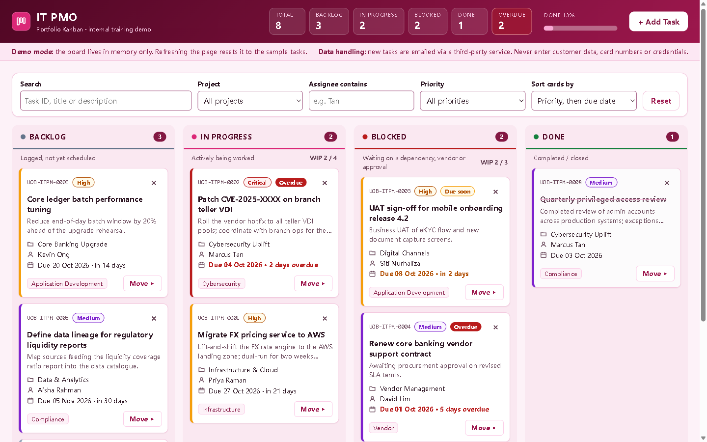

# IT PMO Kanban Board

A single-page Kanban board for a fictitious bank's internal IT Project Management Office, built as a demo and training tool. Tasks move through four columns: Backlog, In Progress, Blocked and Done. New tasks can trigger an email notification through [FormSubmit](https://formsubmit.co). Everything is in one `index.html` file, written in plain HTML, CSS and JavaScript, with no dependencies and no build step.

**Live demo:** https://super211.github.io/kanban/



> Demo mode: the board lives in memory only. Refreshing the page resets it to the eight sample tasks.

## Features

### Board
- **Four columns** with a live count on each. They sit side by side on wide screens, two per row on medium screens, and one per row below 768px.
- **WIP limits**: In Progress allows 4 tasks and Blocked allows 3. The column shows `WIP n / limit` and turns red when over. Moving a card into a full column is still allowed, but shows a warning.
- **Task cards** show the task ID (`UOB-ITPM-####`), title, description, project, assignee, a priority pill, the due date with a relative label ("in 3 days", "2 days overdue") and a category tag.
- **Priority colours**: the card's left border is red for Critical, amber for High, purple for Medium and grey for Low. The priority is always shown as text too.
- **Due-date badges**: **Overdue** for tasks past their due date, and **Due soon** for tasks due within 3 days. Done tasks get neither.
- **Moving cards**: drag and drop with the native HTML5 API, or use the keyboard-friendly **Move ▸** menu on every card. Escape closes open menus.
- **Inline delete confirmation**: "Delete? Yes / No" appears on the card itself, with no browser pop-up.
- **Header**: totals per status, an overdue count and a **Done %** progress bar.
- **Activity log**: a list of board changes for the current session (created, moved, deleted, with times).

### Finding work
- **Search** by task ID, title or description.
- **Filters** by project, by assignee (any name containing the text you type) and by priority.
- **Sorting** by priority then due date, by due date alone, or by task ID.

### Adding tasks
- A side panel with validation errors shown under each field. The due date must be a real date, not in the past, and no more than 5 years ahead.
- **Instant updates**: the new card appears straight away while the email notification is sent in the background. If sending fails, the card stays and a warning appears.

### Accessibility
- Semantic HTML, a label on every input, and a skip link to the board.
- Visible focus rings with at least 3:1 contrast, and all text at WCAG AA contrast or better.
- Controls are at least 32px (44px on phones), and focus returns to the right place after every change.
- Screen-reader announcements for toasts and filter results, and reduced motion when the system setting asks for it.

## Security

The design was threat-modelled with STRIDE. The controls below are layered on top of each other (defence in depth).

| Threat | Control |
|---|---|
| Injected script (XSS) | Every user string goes through `escapeHtml()`. A strict **Content-Security-Policy** only allows the exact inline script and style blocks (SHA-256 hashes), sends data only to `formsubmit.co`, and blocks inline event handlers, `eval`, plugins and `<base>`. |
| Sensitive data leaking to a third party | A **sensitive-data guard** blocks submissions containing payment card numbers (Luhn check), NRIC/FIN-style IDs, passwords or secrets, API keys or tokens, JWTs or private keys. A banner warns users not to enter customer data. |
| Disguised text | Text is normalised (Unicode NFC), and control characters and bidi-override characters are removed. These can make text look different from what it really contains. |
| Inbox flooding | Emails are rate-limited: one every 15 seconds and at most 20 per session. Requests time out after 10 seconds. A hidden honeypot field stops simple bots from sending email. |
| Data sent to the wrong place, or leaking | The endpoint must start with `https://formsubmit.co/ajax/`. Requests send no cookies and no referrer, and refuse redirects. `<meta name="referrer" content="no-referrer">` is set for the page. |
| Forged drag-and-drop | A drop only counts if the drag started on one of the board's own cards. Text dragged in from other apps or pages is ignored. |
| No record of changes | An in-memory activity log records every create, move and delete. |
| Compromised CI dependencies | The deploy workflow pins every action to a full commit SHA, doesn't keep the GitHub token after checkout, has only the permissions Pages needs, and fails if the CSP hashes are out of date. |

**Remaining risks:**
- **Clickjacking:** GitHub Pages can't send HTTP headers, so `frame-ancestors` and `X-Frame-Options` aren't available. Host it somewhere that can send headers if this matters.
- **Inbox address:** the address in `FORMSUBMIT_ENDPOINT` is visible in the page source. Use the random alias FormSubmit gives you after activation instead of the real address.
- **Bypassable checks:** all of these checks run in the browser, so anyone with developer tools can skip them. A production system needs the same checks on the server.

### Editing the code: keep the CSP hashes in sync
Any change to the inline script or style block changes its hash. If the hash isn't updated, the browser blocks that block. After editing, run:

```sh
node scripts/csp-hash.mjs          # update the hashes in index.html
node scripts/csp-hash.mjs --check  # verify them (the deploy workflow runs this)
```

## Run locally

Double-click `index.html`, or open it in any modern browser. No server or install is needed.

## Configuration

The email notification endpoint is set in one constant near the top of the script block in `index.html`:

```js
const FORMSUBMIT_ENDPOINT = "https://formsubmit.co/ajax/YOUR_EMAIL@example.com";
```

Replace `YOUR_EMAIL@example.com` with the inbox that should receive new-task notifications. Then update the CSP hashes (see above).

**FormSubmit activation (one-time):** the first submission sends a confirmation email to that address. Notifications are only delivered after you click the activation link in it. FormSubmit then gives you a random alias. Put the alias in place of the email address so the address isn't public. Until activation, adding a task shows "Card added locally — email notification failed", and the card stays on the board.

## Deployment

Every push to `main` deploys `index.html` to GitHub Pages through [`.github/workflows/pages.yml`](.github/workflows/pages.yml), after checking the CSP hashes. You can also run it by hand from the **Actions** tab.

## Tech stack

Vanilla HTML5, CSS (custom properties) and JavaScript (ES2020). No frameworks, no external resources, no build step. FormSubmit sends the email notifications. Node.js is used only for the CSP hash script.
